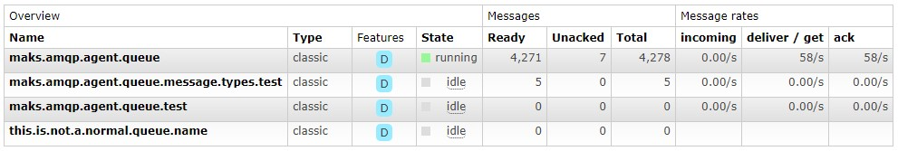

# Workers Testing

Because workers' testing depends on an external server. It needs some kind of babysitting. The documentation below will guide you through it.

AbstractWorker class, Publisher class, and Consumer class require some attention when testing.
Please make sure that a RabbitMQ server is up and running on `localhost` port `5672` with username `guest` and password `guest` (default configuration).

See [Docker Hub](https://hub.docker.com/_/rabbitmq) to get started quickly.

When testing the AbstractWorker class is the above-mentioned requirement is enough. Unfortunately, Publisher and Consumer need more work. First, run `phpunit --filter=PublisherTest` and see if the RabbitMQ management looks like this:

1. Exchanges

2. Queues

If everything looks as expected, then run `phpunit --filter=ConsumerTest`.

Consuming will take quite some time (as there are 15000+ messages with `usleep()` to mimic a real world scenario) so please wait for it and check the management interface for the progress.

* Consuming

When the ConsumerTest finishes you may see that some messages are still in queues. These are redundant messages from the publisher or unacked command messages that RabbitMQ didn't get any acknowledgment for them due to the channel being closed in the callback. These messages have to be deleted manually (by deleting or purging the queue or simply using `rabbitmqadmin -f tsv -q list queues name | while read queue; do rabbitmqadmin -q delete queue name=${queue}; done` in the CLI to delete all queues) after every test if you want to run multiple tests within one hour (command messages expire in one hour) or the next test will behave unexpectedly (in a production environment the messages should have priority and/or expiration so that they get deleted automatically).

If everything went as planned you can now use only `phpunit` to test the entire suite. Please do not forget as mentioned to delete left messages after every test.
